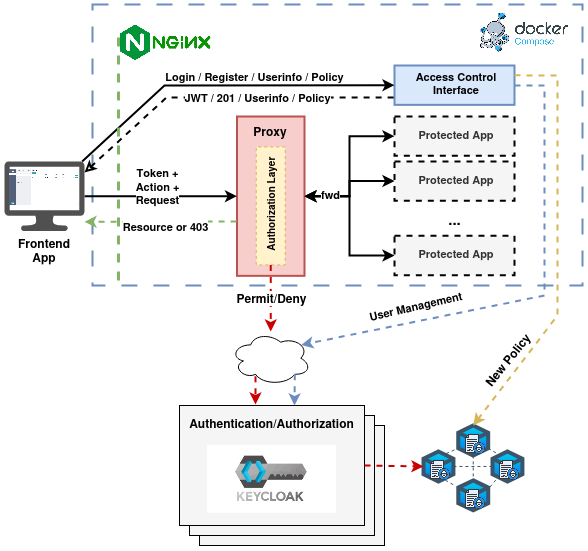

# ExtremeXP Proxy


This project provides a proxy for the ExtremeXP internal modules.

> 💡 The primary purpose of the proxy is to safeguard applications from unauthorized user actions. To accomplish this,
> the proxy intercepts requests and verifies whether the user has the necessary permissions to perform the requested
> action. If the user lacks permission, the request is denied.

## Project Architecture



In the architecture diagram, the ExtremeXP Proxy is shown as the red box representing the security proxy that intercepts
client requests. It verifies each request against Keycloak to determine if the requested resources and actions are
permitted. If the request is permitted, the proxy forwards it to the application. If not, the proxy denies the request.

Furthermore, the proxy is located behind an NginX server, which acts as a reverse proxy, directing all incoming requests
to the ExtremeXP Proxy. All of this is managed using Docker Compose.

---

## Run in development environment

Before starting the project, you need to copy the `.env.example` file to `.env` and fill in the environment variables
correctly.

```bash
# copy the .env.example file to .env
cp .env.example .env
# edit the .env file
vim .env
# install the project development environment
make install
# run the project
make run
```

The server will be running on http://localhost:5522.
The Swagger documentation is available on the root page.

---

## How to Deploy

To deploy the ExtremeXP Proxy, you need to run three components:

1. **ExtremeXP Proxy**: This functions as the security proxy for your application.
2. **ExtremeXP Access Control Interface**: This component manages credentials and allows you to retrieve the OIDC access
   token.
3. **NginX**: This acts as a reverse proxy, redirecting all requests to the ExtremeXP Proxy.

To successfully execute these three components, follow the steps outlined below.

### Step 1: Configure the .env file

Copy the `.env.example` file to `.env` and fill in the environment variables correctly. The `.env` file contains
all the necessary environment variables for the ExtremeXP Proxy, ExtremeXP Access Control Interface, and NginX.

> 💡 Contact the responsible for the Keycloak and request for the necessary information to change in the .env file.
> The variables to change are:
>
> 1. The Keycloak server URL
> 2. The username and password of an admin account of Keycloak
> 3. The Keycloak Realm ID that your application should use
> 4. The Keycloak Client ID that your application should use
> 5. The Keycloak Client Secret of the Client that your application should use

> 🚨 Once you have gathered all the necessary information, you can modify the .env file. Please note that all occurrences
> of `http://localhost:8080` should be replaced with the appropriate Keycloak server URL.

### Step 2: Configure the Docker Compose file

Change your `docker-compose.yml` file to include the ExtremeXP Proxy, ExtremeXP Access Control Interface and NginX
services. Below is an example of how your `docker-compose.yml` file should look like:

```yaml
services:
  nginx:
    image: nginx:latest
    container_name: nginx-servers
    ports:
      - '80:80'
    depends_on:
      - proxy-service
      - access-control-service
      # - ADD HERE YOUR OTHER SERVICES
    restart: always
    environment:
      - PROXY_APP_PORT=${PROXY_APP_PORT}
    volumes:
      - ./nginx.conf:/etc/nginx/nginx.conf:ro
    networks:
      - app_network

  proxy-service:
    image: ghcr.io/yagorezende/extremexp-abacproxy:dev
    container_name: proxy-service
    # flask requires SIGINT to stop gracefully
    # (default stop signal from Compose is SIGTERM)
    stop_signal: SIGINT
    ports:
      - ${PROXY_APP_PORT}:${PROXY_APP_PORT}
    environment:
      - FLASK_APP_HOST=${PROXY_APP_HOST}
      - FLASK_APP_PORT=${PROXY_APP_PORT}
      - FLASK_APP_NAME=${PROXY_APP_NAME}
      - FLASK_APP_DEBUG=${PROXY_APP_DEBUG}
      - FLASK_APP_ENV=${PROXY_APP_ENV}
      - FLASK_APP_SECRET_KEY=${PROXY_APP_SECRET_KEY}
      - FLASK_APP_DATABASE_URI=${PROXY_APP_DATABASE_URI}
      - KEYCLOAK_SERVER_URL=${KEYCLOAK_SERVER_URL}
      - KEYCLOAK_USERNAME=${KEYCLOAK_USERNAME}
      - KEYCLOAK_USER_PASSWORD=${KEYCLOAK_USER_PASSWORD}
      - OIDC_OP_AUTHORIZATION_ENDPOINT=${OIDC_OP_AUTHORIZATION_ENDPOINT}
      - OIDC_OP_ENDSESSION_ENDPOINT=${OIDC_OP_ENDSESSION_ENDPOINT}
      - OIDC_OP_JWKS_ENDPOINT=${OIDC_OP_JWKS_ENDPOINT}
      - OIDC_OP_LOGOUT_ENDPOINT=${OIDC_OP_LOGOUT_ENDPOINT}
      - OIDC_OP_LOGOUT_URL_METHOD=${OIDC_OP_LOGOUT_URL_METHOD}
      - OIDC_OP_TOKEN_ENDPOINT=${OIDC_OP_TOKEN_ENDPOINT}
      - OIDC_OP_USER_ENDPOINT=${OIDC_OP_USER_ENDPOINT}
      - OIDC_RP_CLIENT_ID=${OIDC_RP_CLIENT_ID}
      - OIDC_RP_REALM_ID=${OIDC_RP_REALM_ID}
      - OIDC_RP_CLIENT_SECRET=${OIDC_RP_CLIENT_SECRET}
      - OIDC_RP_SIGN_ALGO=${OIDC_RP_SIGN_ALGO}
    networks:
      - app_network

  access-control-service:
    image: ghcr.io/yagorezende/extremexp_accesscontrol:dev
    container_name: access-control-service
    ports:
      - ${FLASK_AC_APP_PORT}:${FLASK_AC_APP_PORT}
    expose:
      - ${FLASK_AC_APP_PORT}
    environment:
      - FLASK_AC_APP_HOST=${FLASK_AC_APP_HOST}
      - FLASK_AC_APP_PORT=${FLASK_AC_APP_PORT}
      - FLASK_AC_APP_NAME=${FLASK_AC_APP_NAME}
      - FLASK_AC_APP_DEBUG=${FLASK_AC_APP_DEBUG}
      - FLASK_AC_APP_ENV=${FLASK_AC_APP_ENV}
      - FLASK_AC_APP_SECRET_KEY=${FLASK_AC_APP_SECRET_KEY}
      - FLASK_AC_APP_DATABASE_URI=${FLASK_AC_APP_DATABASE_URI}
      - KEYCLOAK_SERVER_URL=${KEYCLOAK_SERVER_URL}
      - KEYCLOAK_USERNAME=${KEYCLOAK_USERNAME}
      - KEYCLOAK_USER_PASSWORD=${KEYCLOAK_USER_PASSWORD}
      - OIDC_OP_AUTHORIZATION_ENDPOINT=${OIDC_OP_AUTHORIZATION_ENDPOINT}
      - OIDC_OP_ENDSESSION_ENDPOINT=${OIDC_OP_ENDSESSION_ENDPOINT}
      - OIDC_OP_JWKS_ENDPOINT=${OIDC_OP_JWKS_ENDPOINT}
      - OIDC_OP_LOGOUT_ENDPOINT=${OIDC_OP_LOGOUT_ENDPOINT}
      - OIDC_OP_LOGOUT_URL_METHOD=${OIDC_OP_LOGOUT_URL_METHOD}
      - OIDC_OP_TOKEN_ENDPOINT=${OIDC_OP_TOKEN_ENDPOINT}
      - OIDC_OP_USER_ENDPOINT=${OIDC_OP_USER_ENDPOINT}
      - OIDC_RP_CLIENT_ID=${OIDC_RP_CLIENT_ID}
      - OIDC_RP_REALM_ID=${OIDC_RP_REALM_ID}
      - OIDC_RP_CLIENT_SECRET=${OIDC_RP_CLIENT_SECRET}
      - OIDC_RP_SIGN_ALGO=${OIDC_RP_SIGN_ALGO}
    command: python app.py
    networks:
      - app_network

  # Add your other services here. 
  # Don't forget to set the same network for all services!

networks:
  app_network:
    driver: bridge
```

> 💡 Notice that the `access-control-service` is the ExtremeXP Access Control Interface, and the `proxy-service` is the
> ExtremeXP Proxy. The NginX service is configured to forward all requests to the `proxy-service`.

### Step 3: Configure NginX

To configure Nginx, you need to reflect the configuration depicted in the architecture figure, i.e., take all the
requests and redirect them to the proxy service. Before starting, copy the [nginx.conf](https://github.com/yagorezende/extremexp-abacproxy/blob/main/nginx/nginx.conf) example file to the root folder
of your project. After that, change the APP_ROUTE, APP_CONTAINER_NAME, and APP_CONTAINER_PORT strings to the correct
values.

> ⭐ Imagine that in your `docker-compose.yaml` file, you added an app called
`backend` operating on port 5001. Also, you want the backend to be reached over the `http://localhost/bkd` route. The
> Nginx server configuration should look like this:

```yaml
server {
          listen 80;

          # Redirect all requests to the proxy service
          location /bkd {
               # capture the original URL changing the path to the backend service
               set $original_url http://backend:5001$uri;

               # pass the request to the proxy service
               proxy_pass http://proxy-service/proxy?to=$original_url&$args;
              
               # set the headers to be passed to the backend service
               proxy_set_header Host $host;
               proxy_set_header X-Forwarded-For $proxy_add_x_forwarded_for;
               proxy_set_header X-Forwarded-Proto $scheme;
          }
     }
```

> 🚨 Notice that for this configuration to work, the NginX server must be able to resolve the `backend` service name.
> This is achieved by running NginX, the `proxy-service`, and the `backend` in the same Docker network.


> 💡 The ExtremeXP Portal has a nice reference for the NginX configuration.
> Please take a look at the [NginX reference](https://github.com/ExtremeXP-VU/ExtremeXP-portal/blob/main/nginx.conf) of the project.


> 🎉 Congratulations! You have successfully configured the ExtremeXP Proxy, ExtremeXP Access Control Interface, and NginX.

---

## How to make a request (after deploy)

After deploying the ExtremeXP Proxy, you need to add the Authorization header to your requests. Without this header, 
the proxy will deny all incoming requests. The Authorization header should contain a Bearer token, which is generated by Keycloak
through the ExtremeXP Access Control Interface.

> 💡 The ExtremeXP Access Control Interface provides a way to retrieve the OIDC access token. Please refer to the
> [ExtremeXP Access Control Interface documentation](https://github.com/yagorezende/extremexp_accesscontrol).

To make a request, you need to pass the Authorization header with the Bearer token. The token is generated by Keycloak
and contains the user's permissions.
**Optionally, you can send an Authorization-Scope header containing the Scope for the request**. The code below shows an
example of a request using Python 3.

```Python3
import requests

url = "http://localhost/api/v1/translator/"

headers = {
    "Authorization": "Bearer <YOUR_TOKEN>",
    "Authorization-Scope": "ReadData"
}

response = requests.request("GET", url, headers=headers)

print(response.text)
```

> 🚨 The request will be denied if the user does not have a valid token and the necessary permissions to perform the action.

---

## How to Use (Managers Only)

### Configuring Keycloak

The proxy intercepts the client request and checks against Keycloak to verify whether the resource and action are
permitted to execute (vide architecture figure). Therefore, the first step to protecting a resource is configuring it on
Keycloak.

> (Optional) On your Keycloak node, go to Clients>your_client>Authorization and add a scope in the "Scopes" tab. Scopes
> define the actions that a user can take with a resource. For example, we created a Scope called "ReadData."


> After creating the Scope, we can define the resources we want to protect. In the Authorization area, click "Create
> resource" in the Resources tab. In the "Name," "Display name," and "URIs" fields, add the path to the resource, as
> shown
> in the image below. Also, add the Scope permitted for the resource.

> At the form's end, click "Add an attribute." On "Key," insert "policy," and in "Value," paste the address of the
> policy to be executed on the blockchain. The image below shows a configuration for a path "/api/v1/translator/" with
> the "ReadData" scope.


> After following these steps, the proxy will check every request with Keycloak. When Keycloak receives a request with
> the same path and scope, it will run the SmartContract with the address of the "policy" attribute. It is worth noting
> that the request is automatically denied if the scope differs from those previously informed.
