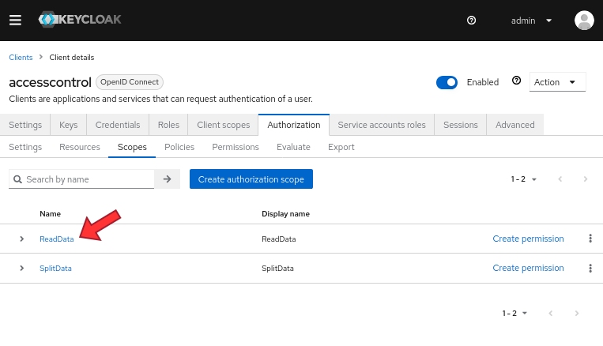

# ExtremeXP Policy Access Control


This project provides a proxy for the ExtremeXP internal modules, enabling the Access Control Based. 

> Note: The translator project is based on the [XACML](https://www.oasis-open.org/committees/xacml/) standard 
and the [Solidity](https://soliditylang.org/) programming language.

## Project Architecture


## Development Progress
#### Overall progress: 


#### Tasks:
- [x] Project Basic Structure (Flask API + Proxy + kickoff script)
- [x] Integrate with the Keycloak Authorization Server (OAuth or MetaMask)
- [x] Dockerize the project
- [x] Integrate with the [ExtremeXP Portal](https://github.com/ExtremeXP-VU/ExtremeXP-portal)

---
## Getting Started (development environment)
Before starting the project, you need to copy the `.env.example` file to `.env` and fill in the environment variables correctly.

```bash
# copy the .env.example file to .env
cp .env.example .env
# edit the .env file
vim .env
# install the project development environment
make install
# run the project
make run
```
The server will be running on http://localhost:5522.
The Swagger documentation is available on the root page.

---
### How to Use

### Configuring Keycloak
The proxy intercepts the client request and checks against Keycloak to verify whether the resource and action are permitted to execute (vide architecture figure). Therefore, the first step to protecting a resource is configuring it on Keycloak.

> (Optional) On your Keycloak node, go to Clients>your_client>Authorization and add a scope in the "Scopes" tab. Scopes define the actions that a user can take with a resource. For example, we created a Scope called "ReadData."



> After creating the Scope, we can define the resources we want to protect. In the Authorization area, click "Create resource" in the Resources tab. In the "Name," "Display name," and "URIs" fields, add the path to the resource, as shown in the image below. Also, add the Scope permitted for the resource.

> At the form's end, click "Add an attribute." On "Key," insert "policy," and in "Value," paste the address of the policy to be executed on the blockchain. The image below shows a configuration for a path "/api/v1/translator/" with the "ReadData" scope.


> After following these steps, the proxy will check every request with Keycloak. When Keycloak receives a request with the same path and scope, it will run the SmartContract with the address of the "policy" attribute. It is worth noting that the request is automatically denied if the scope differs from those previously informed.

---
### How to Deploy
The project is dockerized, so you can deploy it using the following configuration for your docker-compose file:

```yaml
services:
  proxy-service:
    image: ghcr.io/yagorezende/extremexp-abacproxy:dev
    container_name: proxy-service
    # flask requires SIGINT to stop gracefully
    # (default stop signal from Compose is SIGTERM)
    stop_signal: SIGINT
    ports:
      - ${FLASK_APP_PORT}:${FLASK_APP_PORT}
    environment:
      - FLASK_APP_HOST=${FLASK_APP_HOST}
      - FLASK_APP_PORT=${FLASK_APP_PORT}
      - FLASK_APP_NAME=${FLASK_APP_NAME}
      - FLASK_APP_DEBUG=${FLASK_APP_DEBUG}
      - FLASK_APP_ENV=${FLASK_APP_ENV}
      - FLASK_APP_SECRET_KEY=${FLASK_APP_SECRET_KEY}
      - FLASK_APP_DATABASE_URI=${FLASK_APP_DATABASE_URI}
      - KEYCLOAK_SERVER_URL=${KEYCLOAK_SERVER_URL}
      - OIDC_OP_AUTHORIZATION_ENDPOINT=${OIDC_OP_AUTHORIZATION_ENDPOINT}
      - OIDC_OP_ENDSESSION_ENDPOINT=${OIDC_OP_ENDSESSION_ENDPOINT}
      - OIDC_OP_JWKS_ENDPOINT=${OIDC_OP_JWKS_ENDPOINT}
      - OIDC_OP_LOGOUT_ENDPOINT=${OIDC_OP_LOGOUT_ENDPOINT}
      - OIDC_OP_LOGOUT_URL_METHOD=${OIDC_OP_LOGOUT_URL_METHOD}
      - OIDC_OP_TOKEN_ENDPOINT=${OIDC_OP_TOKEN_ENDPOINT}
      - OIDC_OP_USER_ENDPOINT=${OIDC_OP_USER_ENDPOINT}
      - OIDC_RP_CLIENT_ID=${OIDC_RP_CLIENT_ID}
      - OIDC_RP_REALM_ID=${OIDC_RP_REALM_ID}
      - OIDC_RP_CLIENT_SECRET=${OIDC_RP_CLIENT_SECRET}
      - OIDC_RP_SIGN_ALGO=${OIDC_RP_SIGN_ALGO}
```
---
### How to Request a Resource
To make a request, you need to pass the Authorization header with the Bearer token. The token is generated by Keycloak and contains the user's permissions.
Also, is necessary to send a Authorization-Scope header containing the Scope for the request. The code below shows an example of a request using the curl command.

```Python3
import requests

url = "http://localhost/api/v1/translator/"

headers = {
    "Authorization": "Bearer <YOUR_TOKEN>",
    "Authorization-Scope": "ReadData"
}

response = requests.request("GET", url, headers=headers)

print(response.text)
```

> **Note:** The scenario described above is based on a configuration where the proxy is behind a NginX server.
> In this case, the NginX server must be configured to forward the headers to the proxy.
> Please refer to the [NginX reference](https://github.com/yagorezende/extremexp-abacproxy/blob/main/nginx/nginx.conf) for more information.